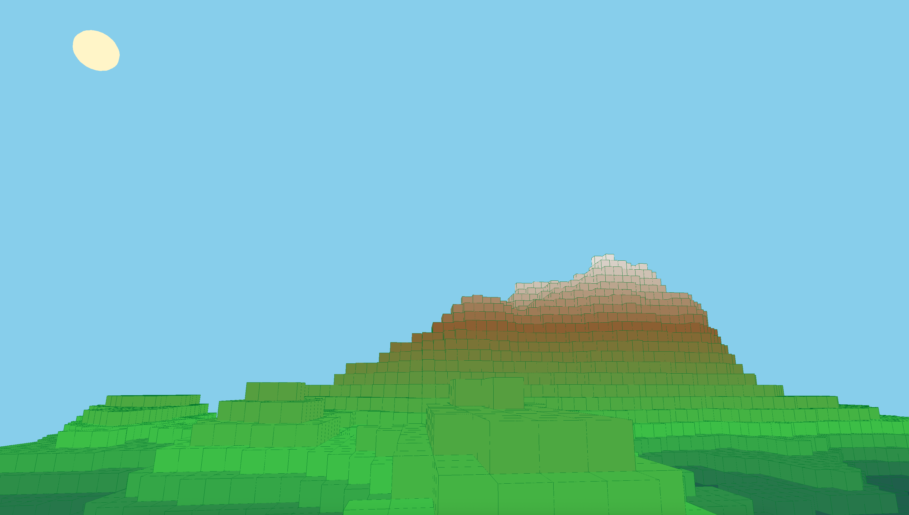
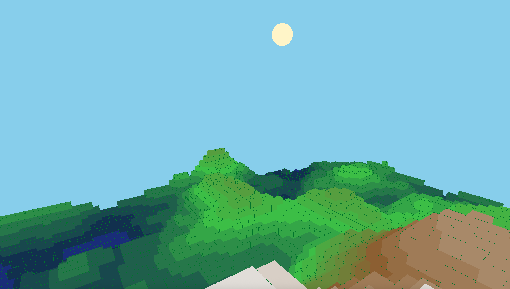

# VoxelTerraformer

VoxelTerraformer is an experimental voxel world project written in C#, focused on chunk-based terrain, real-time terraforming, and clean, extensible architecture.  
The project serves as a foundation for exploring voxel rendering, block interaction, and scalable world systems using raylib.

The goal of VoxelTerraformer is not to be a full game, but a flexible sandbox and technical playground for experimenting with voxel engine concepts.

---

## Features

- Chunk-based voxel world architecture
- Real-time block placement and removal
- Precise voxel raycasting (mouse and keyboard input)
- Simple procedural terrain generation
- Clean separation between world logic, rendering, and utilities
- Designed with scalability and future expansion in mind

---

## Controls

- **W / A / S / D** – Move camera
- **Mouse** – Look around
- **Left Mouse Button** or **O** – Remove block
- **Right Mouse Button** or **P** – Place block

---

## Screenshots

