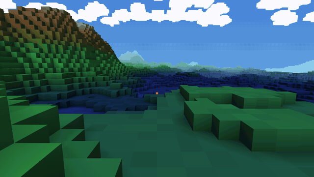
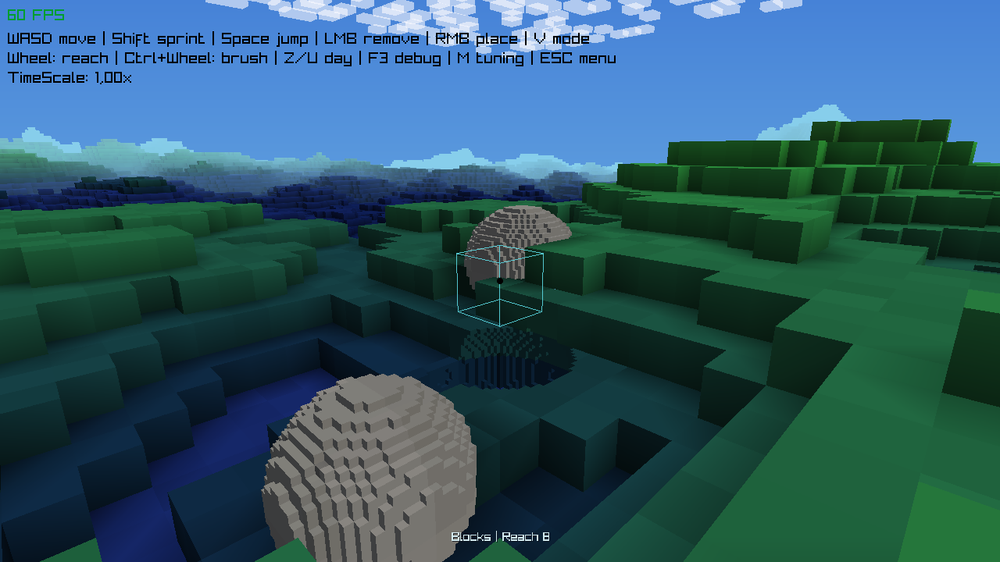
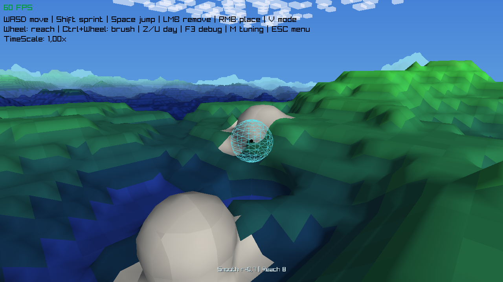

# VoxelTerraformer

A small voxel engine written in C# using raylib, with four games built on top of it.

The project started as an experiment with voxel terrain, but grew into a little playground for trying out different ways of representing and editing a world. You can walk around, dig into the terrain, build things, fly through a solar system, or just mess around with the engine.

The engine takes care of the world, terrain generation, chunk streaming, meshing, rendering, input, UI and audio. The games themselves live under `Games/` and are kept separate from the engine.

The main idea behind the project is to have **one world, but different ways of working with it** — from simple blocks to smooth, fully editable terrain.



[▶ Watch on YouTube](https://www.youtube.com/watch?v=vWNqucjytic)

## Games

Switch between the games at any time with **ESC → Games**.

| Game | What you do |
| --- | --- |
| **Free Walk** | The sandbox. Build, dig, switch between the three voxel modes and play around with the different settings. Mountains and caves can reach 256 blocks in height, and there's a jetpack to help you get around. |
| **Rocket Storm** | Try to survive waves of rockets in Smooth mode. There are standard, cluster, buster and seeker rockets. Dig yourself some cover, shoot them down with the flak and see how high you can get on the local leaderboard. |
| **Solar System** | Explore planets two to four kilometres across, complete with atmospheres, rings, an asteroid belt and real gravity. Fly freely in all six degrees of freedom, dive into an atmosphere, land on the surface and leave craters behind. Two of the planetary cores are molten. |
| **Cave Dive** | Explore an underground world in the dark. Smooth mode only. Use your lantern to find your way, leave lamps behind as markers and dig crystals out of the walls. |

## Three voxel modes, one world

Press **V** to switch between three different ways of working with the same world:

- **Blocks** — place and remove whole blocks.
- **Sculpt** — use a sphere brush to edit the terrain at 8× the resolution of a block.
- **Smooth** — use the same brush, but with rounded terrain generated using marching cubes.

The important part is that these are not separate worlds. The underlying world data stays the same, so you can switch between the modes without losing your changes.

Switching modes is also visual: the new mode spreads across the terrain as a coloured ring, rebuilding the nearest terrain first. The ring only moves forward as the terrain is actually rebuilt.

## How it scales

The world is divided into chunks that are 32 blocks wide and up to 256 blocks tall. Empty chunks, such as areas containing only sky or solid rock, are skipped to save memory.

Chunks are loaded and generated around the player as they are needed. Generation runs on worker threads so it doesn't block the game. Once neighbouring chunks are ready, their meshes can be built.

Chunks close to the player are split into four smaller sections and rendered in full detail. When you edit the terrain, only the sections affected by your changes need to be rebuilt. These updates are given priority so edits appear quickly.

Chunks further away use a simpler version of the terrain. Their blocks are combined into larger 2 m and 4 m sections, reducing the amount of geometry that needs to be rendered.

## Layout

```text
Engine/        VoxelEngine.dll: Core, World, Rendering, Scenes, Input, UI, Audio, Effects, MathTools, Config
Games/<Id>/    one project per game: <Id>.csproj, Scripts/, Assets/
Program.cs     the launcher; finds the games by attribute
Tests/         xunit tests over the engine's pure logic
```

Games only reference the engine and cannot see each other.

Adding a new game is meant to be simple. Create `Games/MyGame/MyGame.csproj`:

```xml
<Project Sdk="Microsoft.NET.Sdk"></Project>
```

Then derive a class from `VoxelEngine.Core.Game` and add the `GameDefinition` attribute:

```csharp
[GameDefinition("MyGame", "My Game", "One-line description")]
public sealed class MyGame : Game { ... }
```

See [Games/README.md](Games/README.md) for more information about what a game gets from the engine.

## Controls

| Key | Action |
| --- | --- |
| **W A S D**, mouse | Move and look. In Solar System you can fly freely, with no fixed up direction. |
| **Shift** / **Space** | Sprint / jump. Hold Space in the air to use the jetpack, or boost upwards in Solar System. |
| **Q** / **E** | Roll the ship in Solar System. |
| **LMB** / **RMB** | Remove / place terrain. Hold in Sculpt and Smooth; charge and fire in Solar System. |
| **Wheel**, **Ctrl + Wheel** | Change build distance / brush size. |
| **V** | Switch voxel mode. |
| **F** | Fire the flak in Rocket Storm / full stop in Solar System. |
| **Z** / **U** | Move the sun / change the clock speed. |
| **M**, **F3**, **ESC** | Tuning menu, debug overlay, and pause menu with display and control settings. |

## Running it

Builds from [Releases](../../releases) are self-contained, so you don't need to install .NET to run them.

From source:

```bash
dotnet run -c Release --project Terraformer.csproj
```



